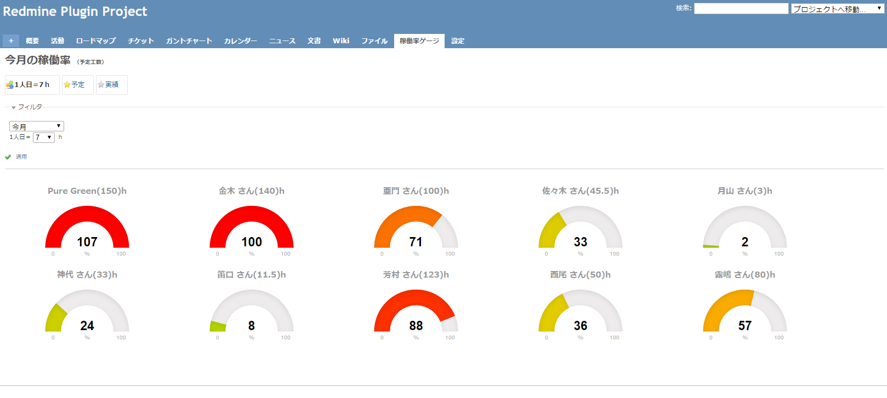

# operating_ratio
This is a Operating Ratio Plugin for Redmine.  
稼働率をゲージで表示するためのRedmine用のプラグインです。  
  

Display in the gauge.  
該当月の予定（予定工数）と実績（作業時間）を切り替えて表示できます。  
  
Manage the efforts of project members.  
プロジェクトメンバーの稼働状況をパッと見で把握するために作りました。  
  
---------------------------------------
  
### Installation
#### インストール（Redmineのプラグインディレクトに移動しプラグインモジュールを取得）
 cd %REDMINE%/htdocs/plugins/  
 git clone git://github.com/puregreen/operating_ratio.git  
  
### set up
#### セットアップ（Redmineのルートに移動しプラグインのセットアップ実行）
 cd %REDMINE%/htdocs/  
 rake db:migrate RAILS_ENV=production  
 rake redmine:plugins:migrate RAILS_ENV=production  
  
### Redmine Restart
#### Redmineを再起動してください

  
---------------------------------------
[source](https://github.com/puregreen/operating_ratio "ソースファイル")  
[author_url](https://twitter.com/nuunlathemungh2/ "制作者のURL")  
[author_url](https://t.co/JQmRVhMmZ7 "制作者のURL")  
  
  
### License  
---------------------------------------
Copyright &copy; 2017 Pure Green.  
Dual licensed under the [MIT license][MIT] and [GPL license][GPL].  
  
[Author Pure Green][APG].  
  
  
[MIT]: http://www.opensource.org/licenses/mit-license.php  
[GPL]: http://www.gnu.org/licenses/gpl.html  
[APG]: https://twitter.com/nuunlathemungh2/  